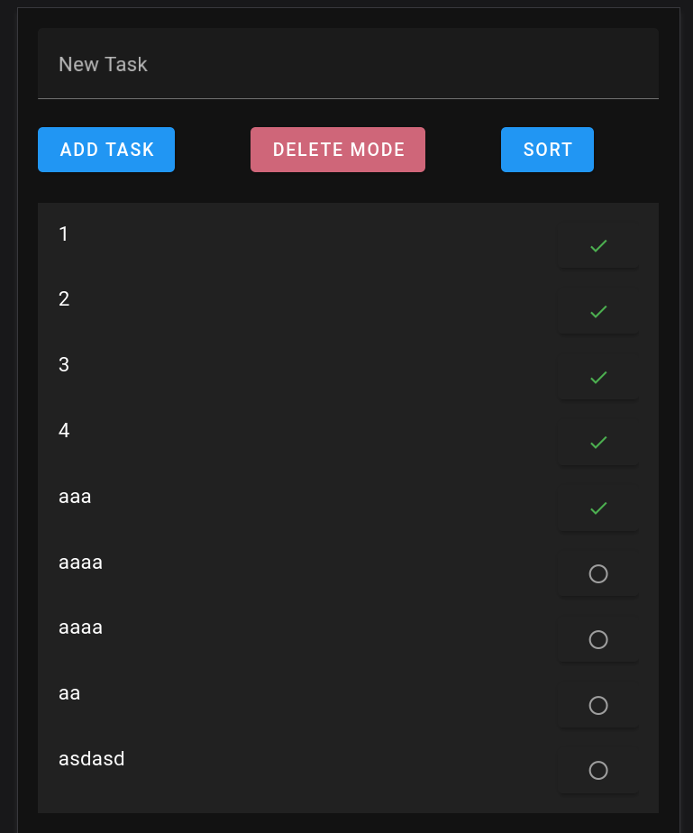
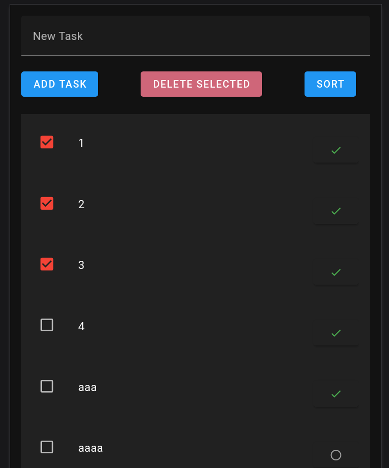
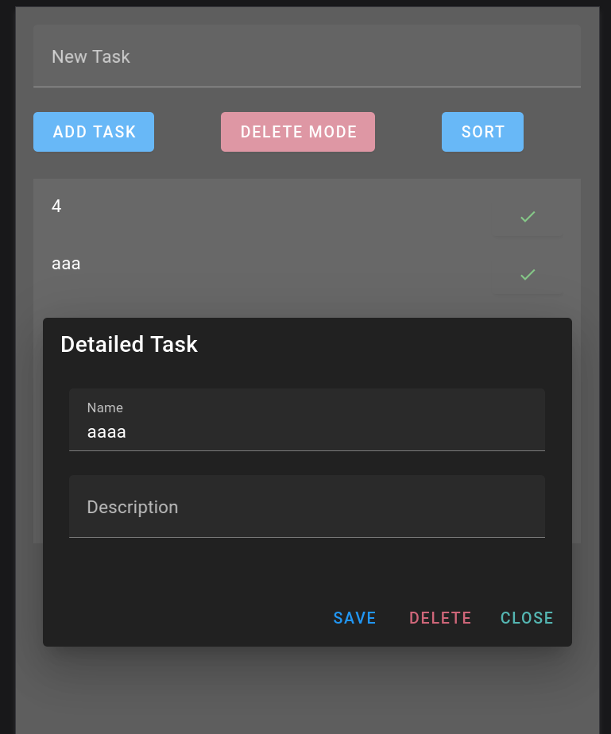
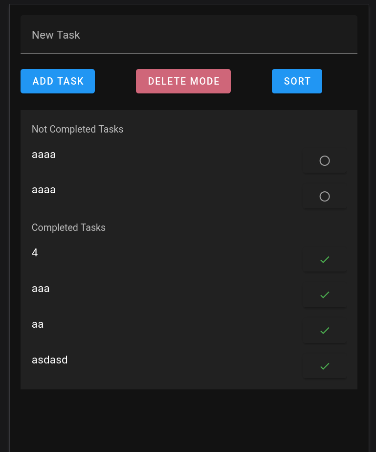

# TODO App
- App to build a todo list of tasks
- To create the App was used the vuetify create app
- Vue 3 + Vite + Vuetify(components) + Pinia(Central State Management)
## To Setup and Run
- Enter web-app folder
- Use the command npm install
- To start use npm run dev

## Expected functionalities
- Adding tasks (use local storage to save);
- Deleting tasks (One or several) 
- Changing tasks;
- Sorting tasks (All, completed, not completed)

## The App looks
- Adding Task

- Delete Mode

- Modal to details of the task

- Sorting Tasks completed and not completed

Its interesting to note that once you are in the sorted mode, when completing a new one, the list updates correctly, without the need to sort again

Fernando Nascimento
fernandodiego.sn@gmail.com